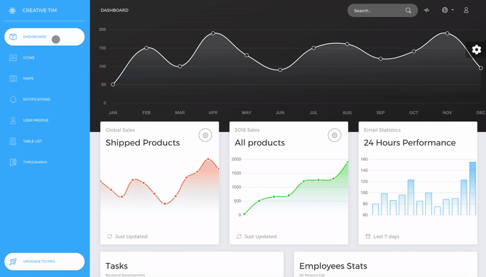
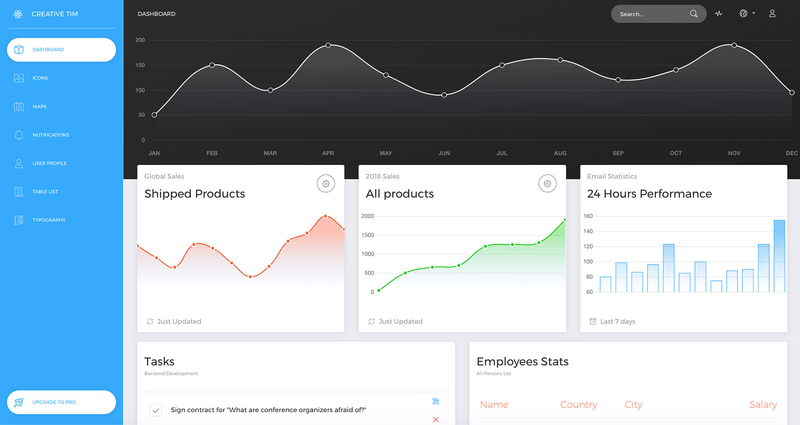
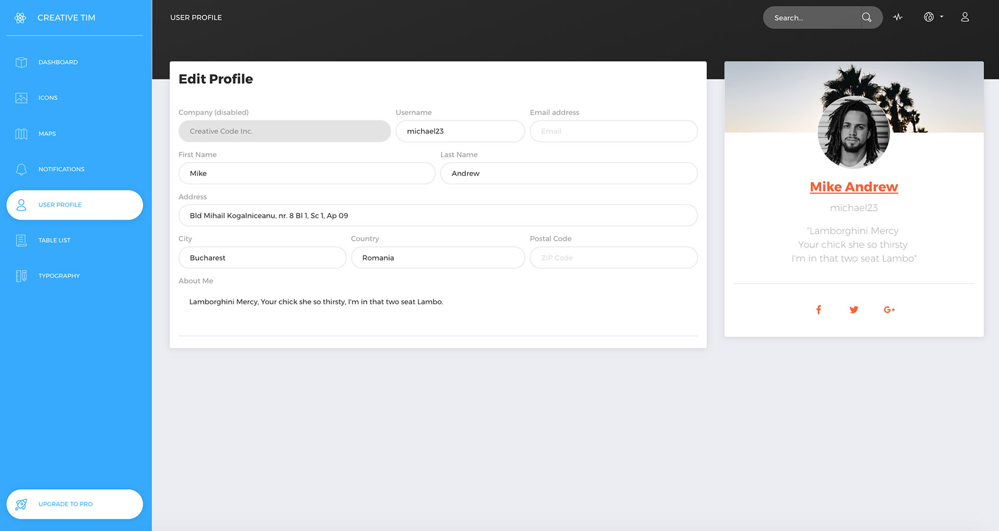
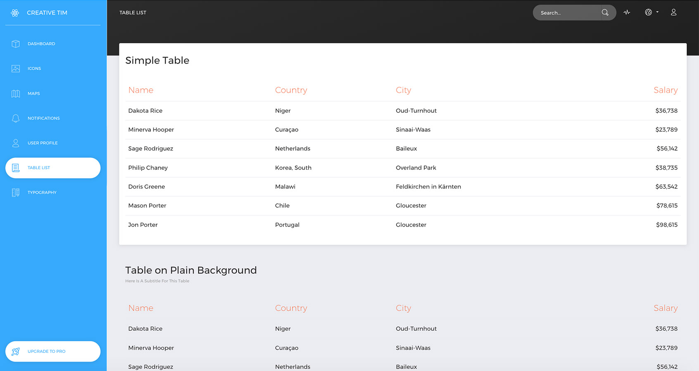
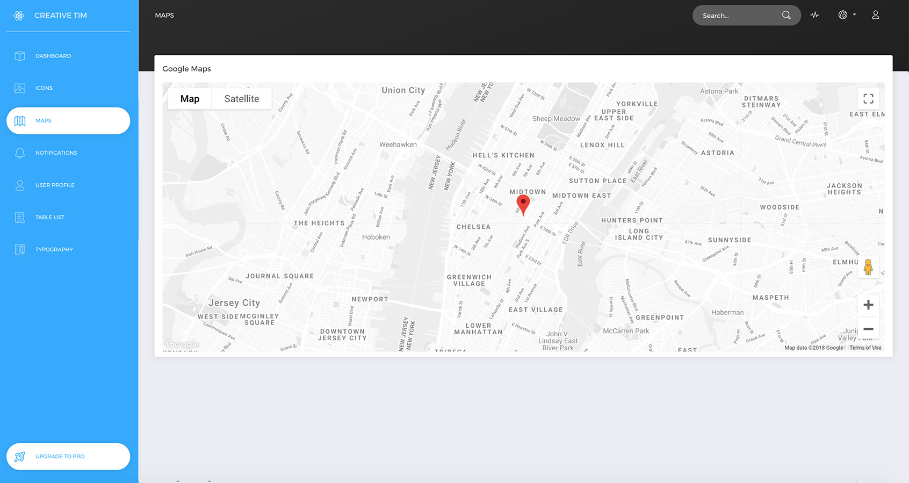
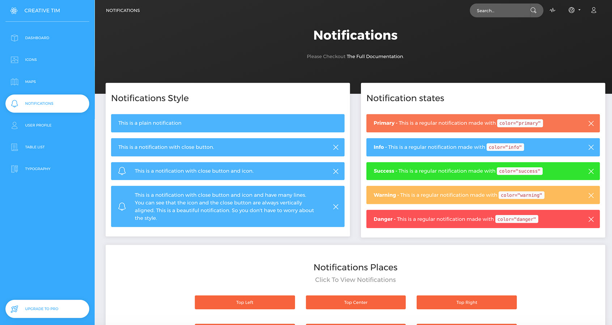

# [Now UI Dashboard React](https://demos.creative-tim.com/now-ui-dashboard-react/#/dashboard) [](https://twitter.com/intent/tweet?url=https%3A%2F%2Fdemos.creative-tim.com%2Fnow-ui-dashboard-react%2F%23%2Fdashboard&text=Now%20UI%20Dashboard%20React%20by%20Creative%20Tim%20%7C%20Free%20React%20Admin%20Template&original_referer=http%3A%2F%2Flocalhost%3A3000%2Fdashboard&via=creativetim&hashtags=react%2Cbootstrap)

  []() []() [](https://discord.gg/E4aHAQy)



**[Now UI Dashboard React](https://demos.creative-tim.com/now-ui-dashboard-react/#/admin/dashboard)** is an admin dashboard template designed to be beautiful and simple. It is built on top of [Reactstrap](https://reactstrap.github.io/) and [React](https://reactjs.org/) ([create-react-app](https://github.com/facebook/create-react-app)), using [Now UI Dashboard](https://www.creative-tim.com/product/now-ui-dashboard) and it is fully responsive. It comes with a big collections of elements that will offer you multiple possibilities to create the app that best fits your needs. It can be used to create admin panels, project management systems, web applications backend, CMS or CRM.

The product represents a big suite of front-end developer tools that can help you jump start your project. We have created it thinking about things you actually need in a dashboard. Now UI Dashboard React contains multiple handpicked and optimized plugins. Everything is designed to fit with one another. As you will be able to see, the dashboard you can access on Creative Tim is a customization of this product.

It comes with 6 filter colors for the sidebar (`black`, `blue`, `green`, `orange`, `red`, `yellow`) and an option to have a background image.

## Table of Contents

- [Versions](#versions)
- [Demo](#demo)
- [Quick Start](#quick-start)
- [Documentation](#documentation)
- [File Structure](#file-structure)
- [Browser Support](#browser-support)
- [Resources](#resources)
- [Reporting Issues](#reporting-issues)
- [Technical Support or Questions](#technical-support-or-questions)
- [Licensing](#licensing)
- [Useful Links](#useful-links)

## Versions

[](https://www.creative-tim.com/product/now-ui-dashboard)
[](https://www.creative-tim.com/product/now-ui-dashboard-react)
[](https://www.creative-tim.com/product/now-ui-dashboard-angular2)

| HTML                                                                                                                                                                      | React                                                                                                                                                                                  | Angular                                                                                                                                                                                       |
| ------------------------------------------------------------------------------------------------------------------------------------------------------------------------- | -------------------------------------------------------------------------------------------------------------------------------------------------------------------------------------- | --------------------------------------------------------------------------------------------------------------------------------------------------------------------------------------------- |
| [](https://www.creative-tim.com/product/now-ui-dashboard) | [](https://www.creative-tim.com/product/now-ui-dashboard-react) | [](https://www.creative-tim.com/product/now-ui-dashboard-angular2) |

## Demo

| Dashboard                                                                                                                   | User Profile                                                                                                                     | Tables                                                                                                                 | Maps                                                                                                             | Notification                                                                                                                              |
| --------------------------------------------------------------------------------------------------------------------------- | -------------------------------------------------------------------------------------------------------------------------------- | ---------------------------------------------------------------------------------------------------------------------- | ---------------------------------------------------------------------------------------------------------------- | ----------------------------------------------------------------------------------------------------------------------------------------- |
| [](https://demos.creative-tim.com/now-ui-dashboard-react/#/admin/dashboard) | [](https://demos.creative-tim.com/now-ui-dashboard-react/#/admin/user) | [](https://demos.creative-tim.com/now-ui-dashboard-react/#/admin/table) | [](https://demos.creative-tim.com/now-ui-dashboard-react/#/admin/maps) | [](https://demos.creative-tim.com/now-ui-dashboard-react/#/admin/notifications) |

[View More](https://demos.creative-tim.com/now-ui-dashboard-react/#/admin/dashboard).

## Quick start

Quick start options:

- `npm i now-ui-dashboard-react` (you will need to import from the dist folder our components)
- Clone the repo: `git clone https://github.com/creativetimofficial/now-ui-dashboard-react.git`.
- [Download from Github](https://github.com/creativetimofficial/now-ui-dashboard-react/archive/main.zip).
- [Download from Creative Tim](https://www.creative-tim.com/product/now-ui-dashboard-react).

## Documentation

The documentation for the Now UI Dashboard React is hosted at our [website](https://demos.creative-tim.com/now-ui-dashboard-react/#/documentation/tutorial).

## File Structure

Within the download you'll find the following directories and files:

```
Now UI Dashboard React
├── CHANGELOG.md
├── Documentation
│   └── tutorial-components.html
├── LICENSE.md
├── README.md
├── package.json
├── public
│   ├── apple-icon.png
│   ├── favicon.ico
│   ├── index.html
│   └── manifest.json
└── src
    ├── assets
    │   ├── css
    │   │   └── demo.css
    │   ├── fonts
    │   │   └── ...
    │   ├── img
    │   │   ├── flags
    │   │   │   └── ...
    │   │   └── ...
    │   └── sass
    │       ├── now-ui-dashboard
    │       │   ├── mixins
    │       │   │   └── ...
    │       │   ├── plugins
    │       │   │   └── ...
    │       │   └── ...
    │       └── now-ui-dashboard.scss
    ├── components
    │   ├── Card
    │   │   └── Card.js
    │   ├── Footer
    │   │   └── Footer.js
    │   ├── FormInputs
    │   │   └── FormInputs.js
    │   ├── Header
    │   │   └── Header.js
    │   ├── Sidebar
    │   │   └── Sidebar.js
    │   └── Task
    │       └── Task.js
    ├── containers
    │   └── App
    │       └── App.js
    ├── elements
    │   ├── CardElements
    │   │   ├── CardLegend.js
    │   │   ├── CardStatistics.js
    │   │   ├── CardStats.js
    │   │   └── UserCardAuthor.js
    │   ├── CustomButton
    │   │   └── CustomButton.js
    │   ├── CustomCheckbox
    │   │   └── CustomCheckbox.js
    │   └── CustomRadio
    │       └── CustomRadio.js
    ├── index.js
    ├── routes
    │   └── app.js
    ├── variables
    │   ├── charts.js
    │   ├── general.js
    │   └── icons.js
    └── views
        ├── Dashboard
        │   └── Dashboard.js
        ├── Icons
        │   └── Icons.js
        ├── Maps
        │   └── Maps.js
        ├── Notifications
        │   ├── NotificationSystem
        │   │   └── NotificationSystem.js
        │   └── Notifications.js
        ├── Table
        │   └── Tables.js
        ├── Typography
        │   └── Typography.js
        └── User
            └── User.js
```

## Browser Support

At present, we officially aim to support the last two versions of the following browsers:

    

## Resources

- Demo: https://demos.creative-tim.com/now-ui-dashboard-react
- Download Page: https://www.creative-tim.com/product/now-ui-dashboard-react
- Documentation: https://demos.creative-tim.com/now-ui-dashboard-react/#/documentation/tutorial
- License Agreement: https://www.creative-tim.com/license
- Support: https://www.creative-tim.com/contact-us
- Issues: [Github Issues Page](https://github.com/creativetimofficial/now-ui-dashboard-react/issues)

## Reporting Issues

We use GitHub Issues as the official bug tracker for the Now UI Dashboard React. Here are some advices for our users that want to report an issue:

1. Make sure that you are using the latest version of the Now UI Dashboard React. Check the CHANGELOG from your dashboard on our [website](https://www.creative-tim.com/).
2. Providing us reproducible steps for the issue will shorten the time it takes for it to be fixed.
3. Some issues may be browser specific, so specifying in what browser you encountered the issue might help.

## Technical Support or Questions

If you have questions or need help integrating the product please [contact us](https://www.creative-tim.com/contact-us) instead of opening an issue.

## Licensing

- Copyright 2023 Creative Tim (https://www.creative-tim.com)
- Licensed under MIT (https://github.com/creativetimofficial/now-ui-dashboard-react/blob/main/LICENSE.md)

## Useful Links

More products from Creative Tim: <https://www.creative-tim.com/products>

Tutorials: <https://www.youtube.com/channel/UCVyTG4sCw-rOvB9oHkzZD1w>

Freebies: <https://www.creative-tim.com/products>

Affiliate Program (earn money): <https://www.creative-tim.com/affiliates/new>

Social Media:

Twitter: <https://twitter.com/CreativeTim>

Facebook: <https://www.facebook.com/CreativeTim>

Dribbble: <https://dribbble.com/creativetim>

Google+: <https://plus.google.com/+CreativetimPage>

Instagram: <https://instagram.com/creativetimofficial>
